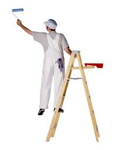

There is no single answer. Grizzled old union painters as well as younger pros all agree that professional painters in Kansas City wear "painters whites" - but nobody seems to know why.

- Whites distinguish painters from other trades.
- White connotes [cleanliness](https://crestwoodpainting.com/reviews/) to customers.
- Clean whites connotes skill to other painters.
- White and other light colors are those most commonly chosen for the widest range of applications.
- White is more comfortable in the summer sun.
- Long ago there was whitewash - Tom Sawyer obviously wasn't a professional as he didn't dress the part!
- Spackle, plaster, caulk and other common trade materials are all white.
- White clothing is economical - costs less than dyed clothing.
- Easy cleaning - white cloth can be bleached easier than colored clothing.

All of the painters at Crestwood wear painters pants and a clean Crestwood uniform shirt. Some of the guys prefer Crestwood baseball hats, some prefer floppy "bucket" hats to help stay out of the sun. Either way, the nice people at [KC Screenprint](http://www.kcscreenprint.com/) do all the embroidery.

Take a look for [more solid information](https://crestwoodpainting.com/12-questions-ask-painter/ "12 Questions to Ask Before You Hire a Painter") or give us a call today!
