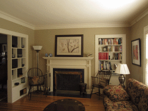

\[caption id="attachment\_1378" align="alignright" width="300"\] Neutral colors in a traditional home.\[/caption\]

Another update from Kansas City color consultant Diane Stewart at [Color Sense Consulting](http://www.colorsenseconsulting.com/). Interior colors can be tricky and, as Diane points out, too often a generic off-white is the not-quite-best choice. Here's Diane Stewart:

There are many things to consider when choosing [interior paint colors.](https://crestwoodpainting.com/chameleon-colors/) It may seem easier to just pick beige, white, or gray. But, if you do, it should be because it’s the right choice for the situation, not the default.

> One of the first things to mull over is whether the paint colors should be in the background, or the main attraction.

Assess your furnishings, artwork, and possessions. If you have many things in various colors, then it makes sense to have a quiet background. But, if you don’t have a lot of stuff, then you can make a statement by filling your rooms with color.

Another piece to take into account is whether you plan to stay, or are considering resale. If you plan on staying, you can personalize your home to suit your taste, and indulge your desire for color. But, if you want your home to appeal to as many potential buyers as possible, then neutrals may be the best choice.

Most people assume that choosing neutrals is easy, but that’s not the case. Every color has an undertone, or the color beneath the color. It’s easy to see yellow-green versus blue-green or orange red versus blue red. But what about beige, white or gray?

Did you know that Benjamin Moore offers over 140 variations of white? Or that beige can have undertones of yellow, pink, or green? And gray can have blue, green, or purple? Unfortunately, the ubiquitous pinky beige is the most difficult undertone to work with, and often shows up in tile and countertops.

If you feel overwhelmed looking at paint chips, you can take the guesswork out of the process by working with a color consultant. In an hour or two, you’ll have a great color scheme specifically designed for your house.
