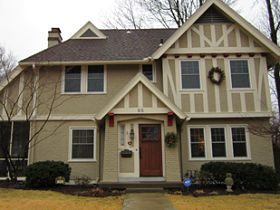
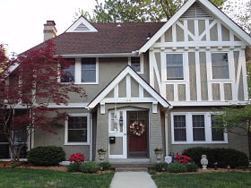

\[caption id="attachment\_1324" align="alignright" width="280"\] After: harmonious colors unify the whole.\[/caption\]

These tips from Diane Stewart, Color & Design Consultant at [Color Sense Consulting](http://www.colorsenseconsulting.com/). With this home, Diane favors softer contrasts and warmer tones that help the whole to blend with the landscape. Older homes or new, Diane consistently delights her customers through both the color process and the final results.

> Bright white paint for trim is overdone. It looks harsh and artificial, and causes glare in sunlight. Instead, off-white, cream, putty, or light gray will provide a softer contrast.

Here's Diane:

There are many factors to consider when planning an [exterior color scheme](https://crestwoodpainting.com/exterior-painting-cost/). Yet, each house is unique, and deserves a customized color plan. If you’re thinking of exterior painting this year, here are some tips to keep in mind.

1. Be aware that fixed surfaces such as brick, stone, roofing materials, and clad surfaces need to be part of the color equation.
2. Muted, earthy tones are usually the best bet if you want your home to fit into the landscape. Think locally, and paint accordingly.
    
    \[caption id="" align="alignright" width="280"\] Before: Harsh contrasts make for a jumbled appearance.\[/caption\]
    
3. Using a bright color for the body of your house may not be appropriate for certain house styles or neighborhoods. Save the brighter colors for accents.
4. You can use the image of a man's suit to help you visualize basic color schemes: siding = suit, trim = shirt, and door = tie. This usually translates to a medium color for siding, lighter one for the trim, and more intense color for the door.
5. Bright white paint for trim is overdone. It looks harsh and artificial, and causes glare in sunlight. Instead, off-white, cream, putty, or light gray will provide a softer contrast.
6. Remember that exteriors encompass a lot of square footage! This magnifies all colors, and makes them brighter and more intense (especially colors with a yellow undertone).
7. An [exterior paint job](https://crestwoodpainting.com/exterior-painting-kansas-city/) can be expensive, and if done right, will last for years. Taking the time to get the best color scheme for your house is worth it.
8. If you feel overwhelmed looking at paint chips, you can take the guesswork out of the process by working with a color consultant. In an hour or two, you’ll have a great color scheme specifically designed for your house.
