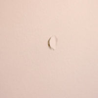

Exterior siding nail - properly set, no moisture infiltration

First, let's understand what a "nail pop" is - simply a nail head that protrudes above the surrounding surface. They're usually caused by structural settling or by normal expansion and contraction - both interior and exterior. Here's how to deal with them.

### Exterior Nail Pops

On exteriors, a nail head that is visible does not mean that nail head has "popped". On exterior work it's generally impractical to make nail heads _invisible_. They should, however, not be _protruding_. On newer construction especially (less than 25 years old, very often "value engineered" plywood siding) structures settle, construction is hurried and sometimes improperly dried lumber is used - a perfect recipe.

If the siding contractor had only adjusted the nail guns to just dimple the siding surface... Or if another second was taken to be sure that each nail was driven perpendicular to the surface... Or if a better quality siding material had been used... But no time or money for all that.

Nail heads that are visible but that have not loosened to break the paint film are doing their job just fine and it's best to let them be. Nails that are protruding should be set flush with a hammer, primed if there is evidence of rust and sealed with a high grade caulk to keep moisture out.

We recently had a suburban homeowner insist on "fixing" visible nail heads. While the were less than a handful on the whole house that had actually "popped", this homeowner wanted her painting contractor to drive all visible nails flush with the siding and then caulk to seal.

### If It Ain't Broke...

Here's the problem: in doing that it's very likely that the nail or surrounding siding will be damaged (errant hammer gouges siding, nail now more likely to rust) or that the nail will be _over_\-driven and the surface membrane will be pierced. And with that is a much greater chance of moisture infiltration, no matter how much caulk is used. The consequence of caulking each nail head is seeing a smooth dab of caulk every 16" on a field of faux-wood or -stucco texture. Yes, you'll see the texture difference right through the paint - and all across the side of the house.

### Interior Nail Pops

Generally the same set of causes, interior nail pops have more straight-forward fixes. If it's loose enough to remove by hand, do so. If not, tap it below the surface. Either way, drive a screw about an inch or two from the offending nail to secure the drywall - this makes a reappearance much less likely as screws have greater holding power.

Now, just skim with spackle or drywall compound, sand smooth  and paint - easy! However, if you're not sure of the status of your "pops", please give us a call.
