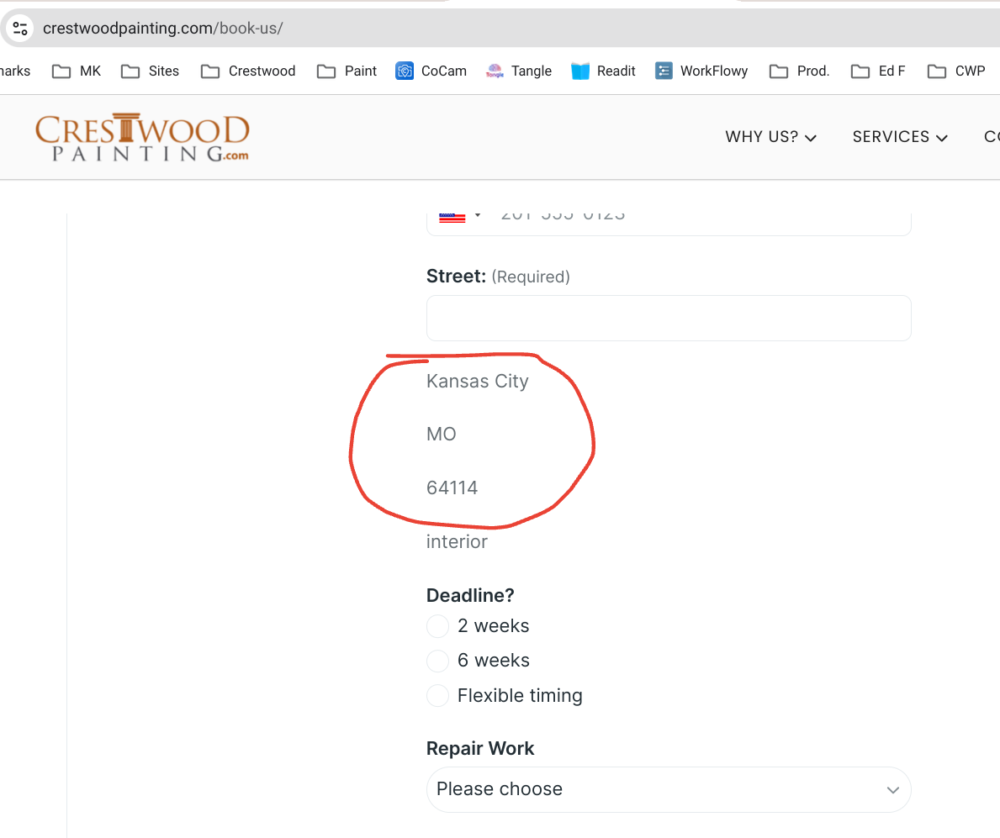

# Developer

[crestwoodpainting.com](https://crestwoodpainting.com),
Hugo v0.133.0 extended
<https://github.com/boetiusj/hugo-dev>

1.  Responsive Images, sized for device. Images are in /assets/ (Home page images are in /static/)
    - New image-render.html?
    - Set Width and Height for each image
    - sized according to device
    - Convert to webp
    - Doesn't interfere with SVGs
    - [This might help](https://www.brycewray.com/posts/2022/06/responsive-optimized-images-hugo/)    
2.  Hero section - image loads slowly and so gives poor Lighthouse score. Only one hero (front page) on the site.
    - Please change hero image to normal image per this - [You can use normal image tags in combination with the CSS object-fit:cover to make normal images behave as background images](https://www.corewebvitals.io/pagespeed/optimize-images-for-core-web-vitals).
    - image here: static/images/january.webp
    - Delete or revise unneeded hero image css
    - CTA button - Hero section CTA button should be below "Homes & Offices" (in addition to the Nav button). See hero.html
3.  Critical CSS - load in Head style. Other css file per usual. Minify.
    - Found this snappy [critical path generator](https://jonassebastianohlsson.com/criticalpathcssgenerator/)
4.  Remove unused CSS 
    - [PurgeCSS Hugo guide](https://purgecss.com/guides/hugo.html) removes unused css with hugo pipes. 
    - [Hugo discourse has PurgeCSS](https://discourse.gohugo.io/t/hugo-guide-added-to-the-purgecss-docs/39422/6) might also help.
    - [This from Hugo about PostCSS](https://gohugo.io/hugo-pipes/postprocess/#css-purging-with-postcss)
5.  [index.html](/home/mike/hugo/index.html) - remove unnecessary 
5.  Appointment booking - customers use the form at [/book-us/](https://crestwoodpainting.com/book-us/) to enter their Zip code. The booking form returns a _three line list_ (image below):
        - City
        - State
        - Zip
    - I would like this list _inline_: City, State Zip. So: City [comma space] State [space] Zip [new line]
    - Assume here: /assets/js/index.js - line 21
    - Try it: use "64113" as the Zip, choose a random date and time
    - Here's the image: 
6.  Blog page - should have Prev Next in bottom empty block. blog/pager.html
7.  [This file](public/painter-in-olathe/index.html) shows in VSCode Source Control right after every build - public/painter-in-olathe/index.html  Why does this happen? OK to Delete?
